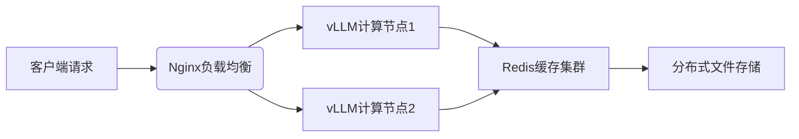

### 🔧 **一、核心架构与技术原理

1. ‌**PagedAttention内存管理**‌  
    vLLM首创的‌**分页显存管理技术**‌（类似操作系统虚拟内存机制），将模型的键值缓存分割为固定大小的内存块，实现动态分配与回收。相比传统方案提升显存利用率3-5倍，支持最高128K上下文长度‌。
    
2. ‌**连续批处理优化**‌  
    通过‌**动态请求调度算法**‌，将不同长度的推理请求打包成统一计算单元，使GPU利用率达90%+。实测在256并发量下首字延迟仅18ms，吞吐量提升40%‌。
    
3. ‌**多模态扩展支持**‌  
    集成视觉语言模型(VLM)适配层，支持图文混合输入。在自动驾驶场景中结合LiteVLM管线，实现6Hz实时推理（FP8量化）‌。