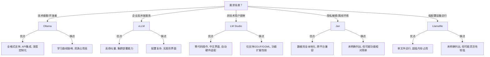

### **Ollama：开发者首选的高灵活度工具**‌

#### ✅ ‌**核心优势**‌

1. ‌**全栈兼容性**‌
    - 原生支持 PyTorch、Safetensors、GGUF 等多种模型格式，无缝对接 Hugging Face 生态‌。
    - 通过 `Modelfile` 自定义模型参数（如 `temperature`、`context_length`），支持角色设定和高级调优‌。
2. ‌**跨平台部署**‌
    - ‌**Linux/macOS**‌：命令行一键安装（`brew install ollama`）‌。
    - ‌**Windows**‌：通过 WSL 集成，或直接运行安装包‌。
3. ‌**开发级扩展**‌
    - 提供 RESTful API（端口 `11434`），轻松集成至现有系统：
        `
```python
        
    import requests 
    response = requests.post('http://localhost:11434/api/chat',
							json={'model': 'llama3', 'messages': [...]}) ‌
```
    - 支持 Docker 容器化部署，适配 Kubernetes 集群调度‌。

#### ⚠️ ‌**局限与挑战**‌

1. ‌**学习曲线陡峭**‌
    - 依赖命令行操作（如 `ollama run llama3`），非技术用户上手困难‌。
    - 调试需监控日志（`--detail` 参数），无图形化性能仪表盘‌。
2. ‌**资源占用较高**‌
    - 默认加载完整模型参数，7B 模型需 ≥8GB 内存，低配设备易崩溃‌。
    - 缺乏动态量化加载机制，小显存显卡（如 RTX 3060 6GB）支持有限‌
#### **vLLM：企业级高性能引擎**
[[vLLM介绍]]
- ‌**优点**‌：
    - ‌**吞吐量碾压**‌：通过 PagedAttention 技术，并发性能达 Ollama 的 ‌**5倍+**‌（实测 5000 tokens/s）‌。
    - 支持多 GPU 分布式推理（如 8 卡 A100 集群），长文本优化显著‌。
- ‌**缺点**‌：
    - 配置复杂，需手动编写服务脚本，调试依赖专业运维‌。
    - 社区版无图形界面，仅提供 Python SDK 和 HTTP API‌。
#### . ‌**Llamafile & Jan：轻量化利器**‌

- ‌**Llamafile**‌：
    - 单文件运行模型（如 `./deepseek.gguf`），无需环境配置‌。
    - 4-bit 量化压缩，7B 模型仅需 4GB 内存‌。
- ‌**Jan**‌：
    - 隐私优先设计，完全离线运行，预装模型开箱即用‌。
    - 支持跨平台（Win/macOS/Linux），界面极简如聊天软件‌