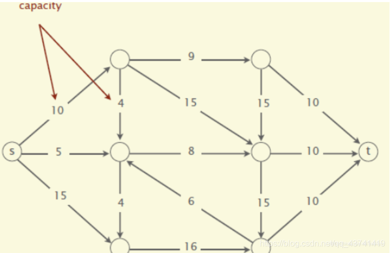
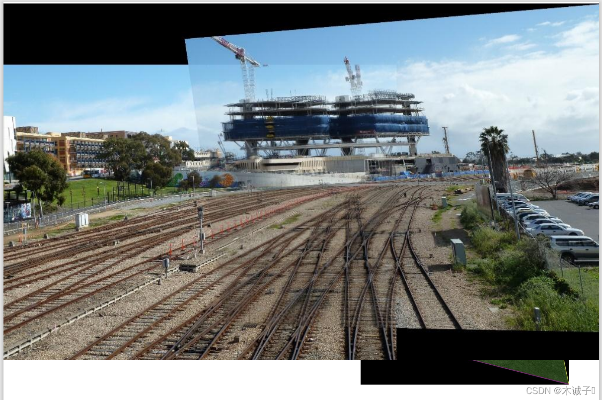
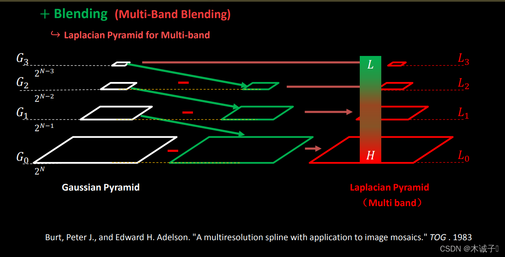
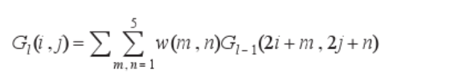
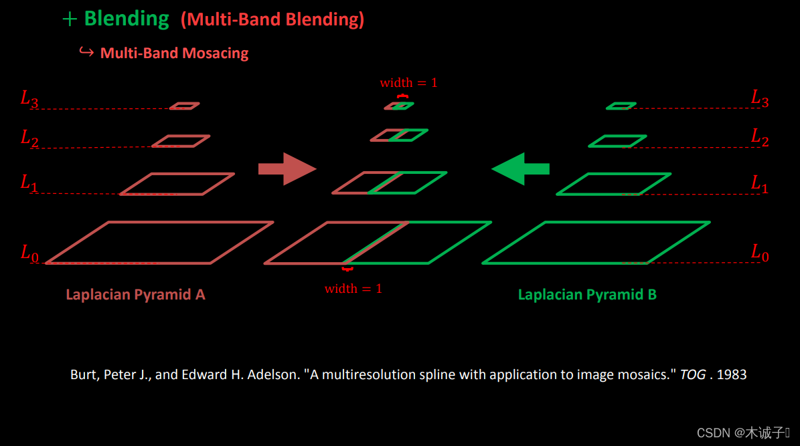

# 全景图像拼接学习笔记

图像处理算法的全景图像拼接。<a href="https://blog.csdn.net/qq_49192977/article/details/124112819" title="超链接title">csdn参考链接</a>
## 基本介绍
图像拼接技术就是将数张有重叠部分的图像（可能是不同时间、不同视角或者不同传感器获得的）拼成一幅无缝的全景图或高分辨率图像的技术。图像拼接在医学成像、计算机视觉、卫星数据、军事目标自动识别等领域具有重要意义。图像拼接的输出是两个输入图像的并集。

图像配准（image alignment）和图像融合是图像拼接的两个关键技术。图像配准是图像融合的基础,而且图像配准算法的计算量一般非常大,因此图像拼接技术的发展很大程度上取决于图像配准技术的创新。早期的图像配准技术主要采用点匹配法,这类方法速度慢、精度低,而且常常需要人工选取初始匹配点,无法适应大数据量图像的融合。图像拼接的方法很多,不同的算法步骤会有一定差异,但大致的过程是相同的。

## 全景图拼接步骤
将SIFT应用到图像拼接上，根据特征点匹配的方式，则利用这些匹配的点来估算单应矩阵使用RANSAC算法，也就是把其中一张通过个关联性和另一张匹配的方法。通过单应矩阵H，可以将原图像中任意像素点坐标转换为新坐标点，转换后的图像即为适合拼接的结果图像。
可以简单分为以下几步:
<ol>
<li>根据给定图像/集，实现特征匹配。</li>
<li>通过匹配特征计算图像之间的变换结构。</li>
<li>利用图像变换结构，实现图像映射。</li>
<li>针对叠加后的图像，采用APAP之类的算法，对齐特征点。(图像配准)</li>
<li>通过图割方法，自动选取拼接缝。</li>
<li>根据multi-band blending策略实现融合。</li>
</ol>

## 原理

### RANSAC算法
RANSAC (随机抽样一致)是一种迭代算法，该算法从一组包含“外点(outlier)”的观测数据中估计数学模型的参数。“外点”指观测数据中的无效数据，通常为噪声或错误数据，比如图像匹配中的误匹配点和曲线拟合中的离群点。与“外点”相对应的是“内点(inlier)”，即用来估计模型参数的有效数据。因此，RANSAC也是一种“外点”检测算法。此外，RANSAC算法是一种非确定算法，它只能在一定概率下产生可信的结果，当迭代次数增加时，准确的概率也会增加。

RANSAC算法是用来找到正确模型来拟合带有噪声数据的迭代方法。
基本思想：数据中包含正确的点和噪声点，合理的模型应该能够在描述正确数据点的同时摈弃噪声点。

RANSAC的基本思想和算法流程如下：
<ol>
<li>随机采样K个点，K是求解模型参数的最少点个数</li>
<li>使用K个点估计模型参数</li>
<li>计算剩余点到估计模型的距离，距离小于阈值则为内点，统计内点的数目</li>
<li>重复步骤1~3，重复次数M且保留数目最多的内点</li>
<li>使用所有的内点重新估计模型</li>
</ol>

### 图像配准
<strong>图像配准是对图像进行变换，使变换后的图像能够在常见的坐标系中对齐。</strong>为了能够进行图像对比和更精细的图像分析，图像配准是一步非常重要的操作。图像配准的方法有很多，这里以APAP算法为例：
<ol>
<li>提取两张图片的sift特征点</li>
<li>对两张图片的特征点进行匹配</li>
<li>匹配后，仍有很多错误点，此时用RANSAC进行特征点对的筛选。筛选后的特征点基本能够一一对应。</li>
<li>使用DLT算法，将剩下的特征点对进行透视变换矩阵的估计。</li>
<li>因为得到的透视变换矩阵是基于全局特征点对进行的，即一个刚性的单应性矩阵完成配准。为提高配准的精度，Apap将图像切割成无数多个小方块，对每个小方块的变换矩阵逐一估计。</li>
</ol>

### 图割方法
最大流最小割算法原理，
<ol>
<li>最小割问题</li>
一个有向图，并有一个源顶点（source vertex）和目标顶点（target vertex）.边的权值为正,又称之为容量（capacity）。如下图:

一个st-cut(简称割cut)会把有向图的顶点分成两个不相交的集合，其中s在一个集合中，t在另外一个集合中。
这个割的容量（capacity of the cut）就是A到B所有边的容量和。注意这里不包含B到A的。最小割问题就是要找到割容量最小的情况。

<li> 最大流问题 </li>
跟mincut问题类似，maxflow要处理的情况也是一个有向图，并有一个原顶点（source vertex）和目标（target vertex），边的权值为正,又称之为容量（capacity）。
<ul>
  <li>初始化，所有边的flow都初始化为0。</li>
  <li>沿着增广路径增加flow。增广路径是一条从s到t的无向路径，但也有些条件，可以经过没有满容量的前向路径（s到t）或者是不为空的反向路径(t->s)。</li>
</ul>
</ol>

### 图像融合
图像拼接之后可以发现，在拼接的交界处有明显的衔接痕迹，存在边缘效应，因为光照色泽的原因使得图片交界处的过渡很糟糕，所以需要特定的处理解决这种不自然。那么这时候可以采用blending方法。multi-band blending是目前图像融和方面比较好的方法。
原理：
<ol>
<li>建立两幅图像的拉普拉斯金字塔</li>
<li>求高斯金字塔（掩模金字塔-为了拼接左右两幅图像）因为其具有尺度不变性</li>
<li>进行拼接blendLapPyrs() ; 在每一层上将左右laplacian图像直接拼起来得结果金字塔resultLapPyr</li>
<li>重建图像: 从最高层结果图将左右laplacian图像拼成的resultLapPyr金字塔中每一层，从上到下插值放大并和下一层相加，即得blend图像结果（reconstructImgFromLapPyramid）</li>
</ol>
且我们可以将拉普拉斯金字塔理解为高斯金字塔的逆形式。

### APAP算法
在图像拼接融合的过程中，受客观因素的影响，<strong>拼接融合后的图像可能会存在“鬼影现象”以及图像间过度不连续等问题。</strong>下图就是图像拼接的一种“鬼影现象”。而APAP算法可以解决鬼影现象。

APAP算法流程:
<ol>
<li>SIFT得到两幅图像的匹配点对</li>
<li>通过RANSAC剔除外点，得到N对内点</li>
<li>利用DLT和SVD计算全局单应性</li>
<li>将源图划分网格，取网格中心点，计算每个中心点和源图上内点之间的欧式距离和权重</li>
<li>将权重放到DLT算法的A矩阵中，构建成新的W*A矩阵，重新SVD分解，自然就得到了当前网格的局部单应性矩阵</li>
<li>遍历每个网格，利用局部单应性矩阵映射到全景画布上，就得到了APAP变换后的源图</li>
<li>最后就是进行拼接线的加权融合</li>
</ol>
APAP算法虽然能够较好地完成配准，但非常依赖于特征点对。若图像高频信息较少，特征点对过少，配准将完全失效，并且对大尺度的图像进行配准，其效果也不是很好，一切都决定于特征点对的数量。

### multi-band bleing算法
在找完拼接缝后，由于图像噪声、光照、曝光度、模型匹配误差等因素，直接进行图像合成会在图像重叠区域的拼接处出现比较明显的边痕迹。
这些边痕迹需要使用图像融合算法来消除。这里介绍一种方法—multi-band bleing
#### 思想：
采用的方法是直接对带拼接的两个图片进行拉普拉斯金字塔分解，后一半对前一半进行融合
#### 步骤：
首先计算当前待拼接图像和已合成图像的重叠部分。并对图像A、B 重叠部分进行高斯金字塔和拉普拉斯金字塔分解

G0为原始图像，G1表示对G0做reduce操作。Reduce操作定义如下：

对G1进行扩展后与G0相减，可以得到拉普拉斯金字塔的第一层L0。同理，拉普拉斯金字塔的L2、L3等层也可以按照这种方法来计算。
两幅图像的融合过程：分别构建图像A、B的高斯金字塔和拉普拉斯金字塔，然后进行加权融合。
对加权后的拉普拉斯金字塔进行重构

