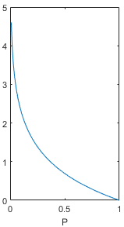

# 交叉熵的理解

交叉熵（Cross Entropy）是信息论和机器学习中的一种度量方法，**用来衡量两个概率分布之间的差异。** 它通常用于分类问题中评估模型预测的概率分布与真实分布之间的距离。

对于两个概率分布 $P$ 和 $Q$，其中 $P$是真实分布，$Q$是模型预测的分布，交叉熵定义为：
 $$ H(P,Q) = -\sum_x P(x)logQ(x) $$
 - $P(x)$表示事件 $x$在真实分布中的概率。
 - $Q(x)$表示事件 $x$在预测分布中的概率。
 - 交叉熵衡量的是在使用分布 $Q$ 来描述数据时，与真实分布 $P$之间的差异。

## 信息量
==事件包含的信息量应与其发生的概率负相关。==
事件发生的可能性越大，其信息量越低，可能性越小，其信息量越高。

假设X是一个离散型随机变量，它的取值集合为 $\{x_1, x_2,\cdots , x_n\}$
，定义事件 $X=x_i$ 的信息量为：
$$ I(x_i) = -logP(X=x_i) $$
其中，log表示自然对数，底数为e（也有资料使用底数为2的对数）。公式中，因为变量取值为的概率，这个概率值应该落在0到1之间，画出上面函数在P为$0-1$时的取值，图像如下。==在概率值趋向于0时，信息量趋向于正无穷，在概率值趋向于1时，信息量趋向于0，==这个函数能够满足信息量的基本想法，可以用来描述信息量。

## 熵

上面给出的信息量公式只能处理随机变量的取指定值时的信息量，我们可以用 **香农熵（简称熵）** 来对==整个概率分布的平均信息量进行描述。==具体方法为求上述信息量函数关于概率分布P的期望，这个期望值（即熵）为：

$$ H(X) = -\sum_{i=1}^n P(X=x_i)logP(X=x_i)  $$

那些接近确定性的分布（输出几乎可以确定）具有较低的熵，那些接近均匀分布的概率分布具有较高的熵。

## 相对熵（KL散度）
假设随机变量的真实概率分布为$𝑃(𝑋)$，而我们在处理实际问题时使用了一个近似的分布来进行建模。由于我们使用的是而不是真实的$P(X)$，所以我们在具体化的取值时需要一些附加的信息来抵消分布不同造成的影响。我们需要的平均附加信息量可以使用相对熵，或者叫KL散度（Kullback-Leibler Divergence）来计算，KL散度可以用来衡量两个分布的差异：

$$ D_{KL}(P||Q) = -\sum_{i=1}^nP(x_i)logQ(x_i) - (-\sum_{i=1}^n P(x_i)logP(x_i)) = \sum_{i=1}^nP(x_i)log\frac{P(x_i)}{Q(x_i)}$$

下面介绍KL散度的两个性质：

- KL散度不是一个对称量，$D_{KL}(P\left | \right |Q)\neq D_{KL}(Q\left | \right |P)$
- KL散度的值始终 $\geqslant0$，当且仅当 $P(X)=Q(X)$ 时等号成立.

## 交叉熵

由上述KL散度公式可得：
$$ D_{KL}(P||Q) = -\sum_{i=1}^nP(x_i)logQ(x_i) - (-\sum_{i=1}^n P(x_i)logP(x_i)) = -H(P(X)) -  \sum_{i=1}^nP(x_i)logQ(x_i)$$

交叉熵 $H(P,Q)$ 就等于：

$$ H(P,Q) = H(P)+D_{KL}(P||Q)=−\sum_{i=1}^n P(x_i)logQ(x_i)  $$

也就是KL散度公式的右半部分（带负号）。

如果把 $P$ 看作随机变量的真实分布的话，KL散度左半部分的其实是一个固定值，KL散度的大小变化其实是由右半部分交叉熵来决定的，因为右半部分含有近似分布，我们可以把它看作网络或模型的实时输出，把KL散度或者交叉熵看做真实标签与网络预测结果的差异，所以神经网络的目的就是通过训练使近似分布逼近真实分布。**从理论上讲，优化KL散度与优化交叉熵的效果应该是一样的。** 所以我认为，在深度学习中选择优化交叉熵而非KL散度的原因可能是为了减少一些计算量，交叉熵毕竟比KL散度少一项。

## 交叉熵损失函数