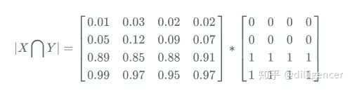

# Dice loss
dice是一种集合相似度度量函数，通常用于计算两个样本的相似度，取值范围在[0,1]，Dice系数如下：

   

Dice Loss：
    

Laplace smoothing:

Laplace smoothing 是一个可选改动，即将分子分母全部加 1：

带来的好处：
（1）避免当|X|和|Y|都为0时，分子被0除的问题
（2）减少过拟合

## Dice 系数计算

首先将 |X∩Y| 近似为预测图pred和label GT 之间的点乘，并将点乘的元素的结果相加：

（1）预测分割图与 GT 分割图的点乘：

(2) 逐元素相乘的结果元素的相加和：

对于二分类问题，GT分割图是只有0,1两个值的，因此 |X∩Y| 可以有效的将在 Pred 分割图中未在 GT 分割图中激活的所有像素清零. 对于激活的像素，主要是惩罚低置信度的预测，较高值会得到更好的 Dice 系数.

(3)计算|X|和|Y|，这里可以采用直接元素相加，也可以采用元素平方求和的方法：

