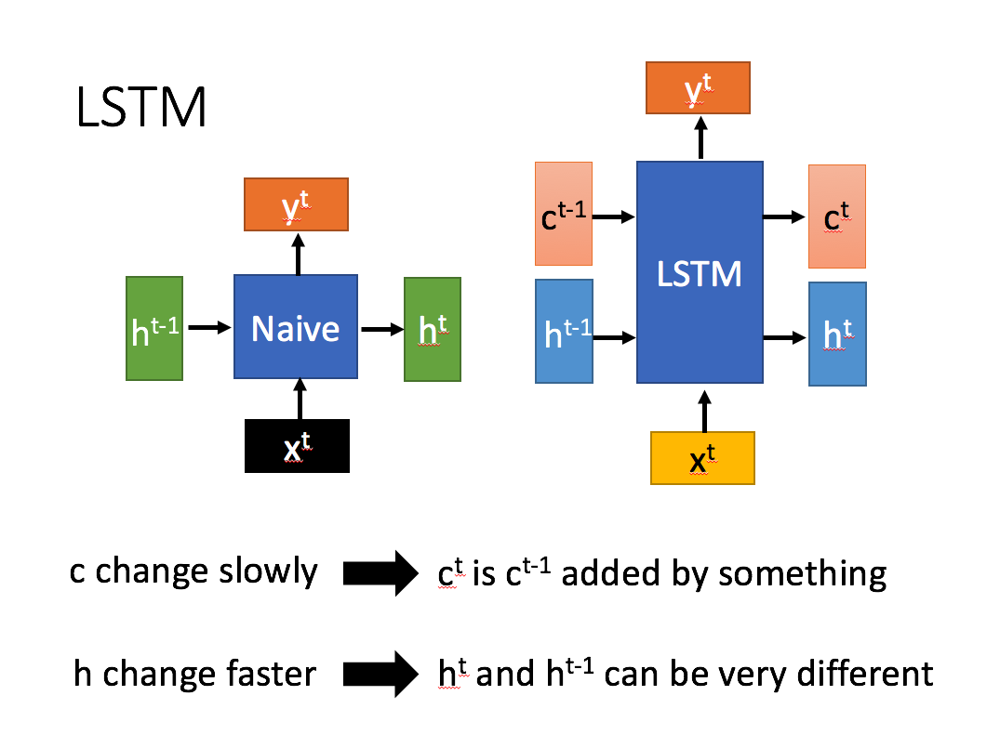

# LSTM

长短期记忆（Long short-term memory, LSTM）是一种特殊的RNN，主要是为了解决长序列训练过程中的梯度消失和梯度爆炸问题。简单来说，就是相比普通的RNN，LSTM能够在更长的序列中有更好的表现。

LSTM结构（图右）和普通RNN的主要输入输出区别如下所示。

相比RNN只有一个传递状态 $h^t$ ，LSTM有两个传输状态，一个 $c^t$ （cell state），和一个 $h^t$ （hidden state）。（Tips：RNN中的  $h^t$ 对于LSTM中的  $c^t$ ）

其中对于传递下去的 $c^t$ 改变得很慢，通常输出的 $c^t$ 是上一个状态传过来的  $c^{t-1}$  加上一些数值。

而 $h^t$ 则在不同节点下往往会有很大的区别。

