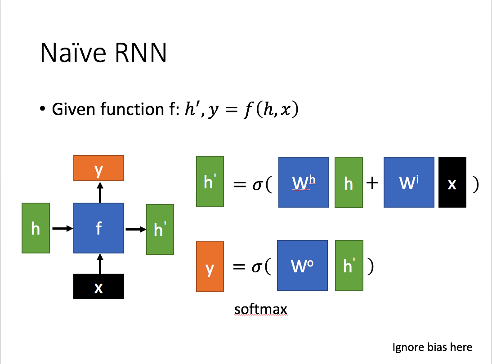
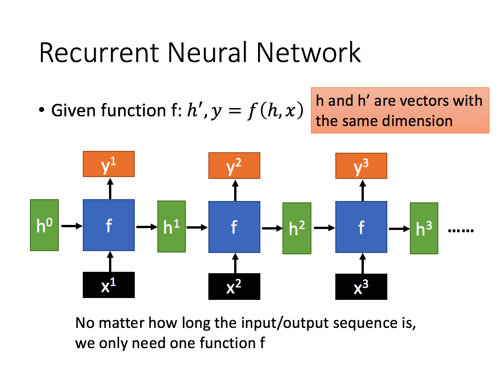

# RNN

循环神经网络 (RNN) 与前馈和卷积神经网络 (CNN) 一样，循环神经网络利用训练数据进行学习。区别在于它们的“记忆”，因为它们从先前的输入中获取信息，用于影响当前的输入和输出。传统的深度神经网络假设输入和输出相互独立，而循环神经网络的输出则取决于序列中的先验元素。虽然未来的事件也有助于确定给定序列的输出，但单向递归神经网络无法在其预测中解释这些事件。

这里：

 x为当前状态下数据的输入， h表示接收到的上一个节点的输入。

 y为当前节点状态下的输出，而 h'为传递到下一个节点的输出。

通过上图的公式可以看到，输出 h' 与 x 和 h 的值都相关。

而 y 则常常使用 h' 投入到一个线性层（主要是进行维度映射）然后使用softmax进行分类得到需要的数据。

对这里的y如何通过 h' 计算得到往往看具体模型的使用方式。

通过序列形式的输入，我们能够得到如下形式的RNN。

