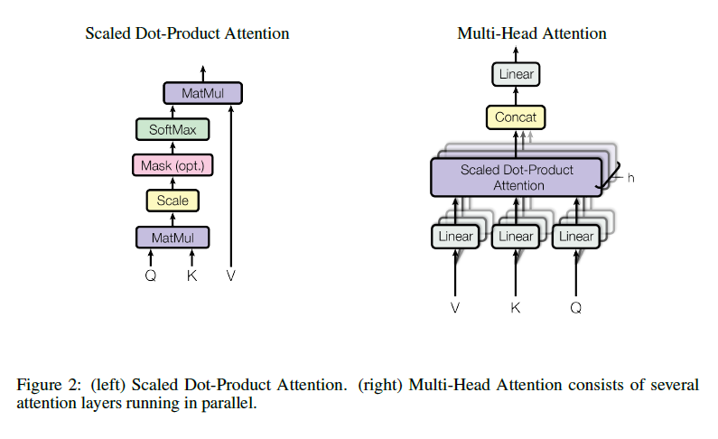
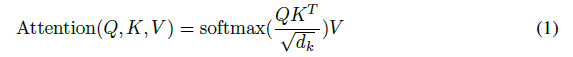
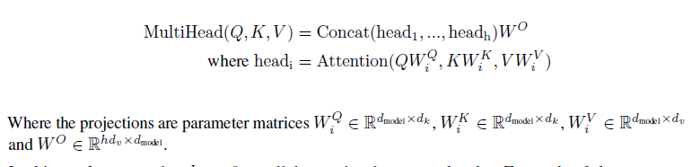

# Multi-Head Attention

The input consists of queries and keys of dimension $d_k$, and values of dimension $d_v$. We compute the dot products of the query with all keys, divide each by $\sqrt{d_k}$, and apply a softmax function to obtain the weights on the values.

计算Q、K点积后除以$\sqrt{d_k}$是为了防止梯度消失。原文解释如下：

We suspect that for large values of $d_k$, the dot products grow large in magnitude, pushing the softmax function into regions where it has extremely small gradients . To counteract this effect, we scale the dot products by $\frac{1}{\sqrt{d_k}}$.

多头注意力公式如下：

原文解释如下：

Multi-head attention allows the model to jointly attend to information from different representation
subspaces at different positions. With a single attention head, averaging inhibits this.

多头attention（Multi-head attention）结构如上图，Query，Key，Value首先进过一个线性变换，然后输入到放缩点积attention，注意这里要做h次，也就是所谓的多头，每一次算一个头，**头之间参数不共享，**每次Q，K，V进行线性变换的参数是不一样的。然后将h次的放缩点积attention结果进行拼接，再进行一次线性变换得到的值作为多头attention的结果

