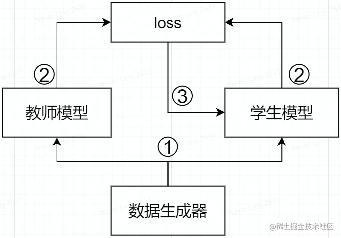
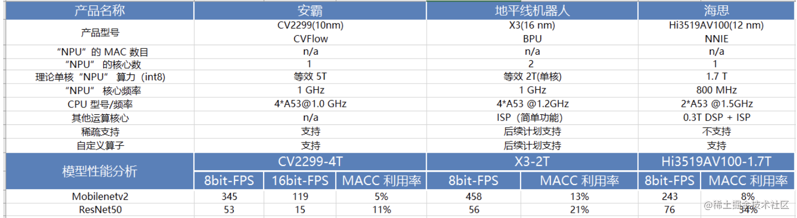
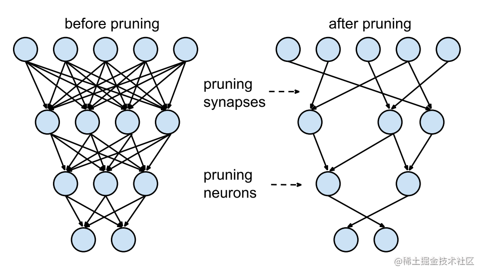

Reference：<a href="https://developer.huawei.com/consumer/cn/forum/topic/0201114102935045054" title="超链接title">参考链接</a>

# 1. 模型压缩算法概述
模型压缩算法旨在将一个大模型转化为一个精简的小模型。工业界的模型压缩方法有：知识蒸馏、轻量化模型架构、剪枝、量化。

按照压缩过程对网络结构的破坏程度，《解析卷积神经网络》一书中将模型压缩技术分为“前端压缩”和“后端压缩”两部分:

<li>前端压缩，是指在不改变原网络结构的压缩技术，主要包括知识蒸馏、轻量级网络（紧凑的模型结构设计）以及滤波器（filter）层面的剪枝（结构化剪枝）等；</li>
<li>后端压缩，是指包括低秩近似、未加限制的剪枝（非结构化剪枝/稀疏）、参数量化以及二值网络等，目标在于尽可能减少模型大小，会对原始网络结构造成极大程度的改造。</li>

总结：前端压缩几乎不改变原有网络结构（仅仅只是在原模型基础上减少了网络的层数或者滤波器个数），后端压缩对网络结构有不可逆的大幅度改变，造成原有深度学习库、甚至硬件设备不兼容改变之后的网络。其维护成本很高。

工业界主流的模型压缩方法有：知识蒸馏（Knowledge Distillation，KD）轻量化模型架构（也叫紧凑的模型设计）、剪枝（Pruning）、量化（Quantization）。各个模型压缩方法总结如下：
| 模型压缩方法  | Description |涉及的网络层  |example |
| ----------- | ----------- |----------- |----------- |
| 知识蒸馏      | 迁移学习的一种，主要思想是将学习能力强的复杂教师模型中的“知识”迁移到简单的学生模型中。| 卷积和全连接层 |经典KD论文，属于蒸 "logits"方法，将Teacher Network输出的soft label作为标签来训练Student Network。必须重新训练模型。 |
| 轻量化模型架构 | 轻量级网络的核心是在尽量保持精度的前提下，从体积和速度两方面对网络进行轻量化改造。|卷积层/卷积模块|Mobilenet 提出深度可分离卷积；shufflenetv2 论文 提出的四个高效网络设计的实用指导思想；RepVGG 提出重参数化思想。都需要重新设计 backbone 和和重新训练模型。|
| 剪枝 | 将权重低于阈值的连接都从网络中删除。|卷积层和全连接层|韩松2016年Deep Compression属于开山之作，剪枝步骤：正常训练，删除网络中权重低于阈值的连接层，重新训练。需要重新训练模型。|
| 量化 |指将神经网络的浮点算法转换为定点算法 |卷积、全连接、激活、BN层等|TensoRT框架中的基于 KL 散度方法的INT8量化策略是主流技术。PTQ 训练后量化方法不需要重新训练模型。|

# 2. 知识蒸馏
一个复杂模型可由多个简单模型或者强约束条件训练得到。复杂模型特点是性能好，但其参数量大，计算效率低。小模型特点是计算效率高，但是其性能较差。知识蒸馏是让小模型去拟合大模型，从而让小模型学到与大模型相似的函数映射。使其保持其快速的计算速度前提下，同时拥有复杂模型的性能，达到模型压缩的目的。模型蒸馏的关键在于监督特征的设计，例如使用 Soft Target（软标签 KD） 所提供的类间相似性作为依据，或使用大模型的中间层特征图或 attention map 作为暗示，对小网络进行训练。整体的框架图如图下所示。

# 3. 轻量化模型架构
关于如何手动设计轻量级网络的研究，目前还没有广泛通用的准则，只有一些指导思想，和针对不同芯片平台（不同芯片架构）的一些设计总结，建议大家从经典论文中吸取指导思想和建议，然后自己实际做各个硬件平台的部署和模型性能测试。

## 3.1 如何设计高效CNN架构
一些结论：
<ol>
<li> 分析模型的推理性能得结合具体的推理平台（常见如：英伟达 GPU、移动端 ARM CPU、端侧 NPU 芯片等）；目前已知影响 CNN 模型推理性能的因素包括: 算子计算量 FLOPs（参数量 Params）、卷积 block 的内存访问代价（访存带宽）、网络并行度等。但相同硬件平台、相同网络架构条件下， FLOPs 加速比与推理时间加速比成正比。 </li>

<li> 对于轻量级网络设计应该考虑<strong>直接metric</strong>（例如速度 speed），而不是间接 metric（例如 FLOPs）。 </li>
<li> FLOPs 低不等于 latency 低，尤其是在有加速功能的硬体 (GPU、DSP 与 TPU)上不成立，得结合具硬件架构具体分析。 </li>
<li> 不同网络架构的 CNN 模型，即使是 FLOPs 相同，但其 MAC 也可能差异巨大。 </li>
<li> Depthwise 卷积操作对于流水线型 CPU、ARM 等移动设备更友好，对于并行计算能力强的 GPU 和具有加速功能的硬件（专用硬件设计-NPU 芯片）上比较没有效率。Depthwise 卷积算子实际上是使用了大量的低 FLOPs、高数据读写量的操作。因为这些具有高数据读写量的操作，再加上多数时候 GPU 芯片算力的瓶颈在于访存带宽，使得模型把大量的时间浪费在了从显存中读写数据上，从而导致 GPU 的算力没有得到“充分利用”。结论来源知乎文章-FLOPs与模型推理速度和论文 G-GhostNet。 </li>
</ol>

一些建议：
<ol>
<li> 在大多数的硬件上，channel 数为 16 的倍数比较有利高效计算。如海思 351x 系列芯片，当输入通道为 4 倍数和输出通道数为 16 倍数时，时间加速比会近似等于 FLOPs 加速比，有利于提供 NNIE 硬件计算利用率。(来源海思 351X 芯片文档和 MobileDets 论文) </li>
<li> 低 channel 数的情况下 (如网路的前几层)，在有加速功能的硬件使用普通 convolution 通常会比 separable convolution 有效率。（来源 MobileDets 论文） </li>
<li> shufflenetv2论文提出的四个高效网络设计的实用指导思想: G1同样大小的通道数可以最小化 MAC、G2-分组数太多的卷积会增加MAC、G3-网络碎片化会降低并行度、G4-逐元素的操作不可忽视。 </li>
<li> GPU 芯片上 3×33×3 卷积非常快，其计算密度（理论运算量除以所用时间）可达 1×11×1 和 5×55×5 卷积的四倍。（来源 RepVGG 论文） </li>
<li> 从解决梯度信息冗余问题入手，提高模型推理效率。比如 CSPNet 网络。 </li>
<li> 从解决 DenseNet 的密集连接带来的高内存访问成本和能耗问题入手，如 VoVNet 网络，其由 OSA（One-Shot Aggregation，一次聚合）模块组成。 </li>
</ol>

## 3.2 轻量级模型部署总结
在阅读和理解经典的轻量级网络 mobilenet 系列、MobileDets、shufflenet 系列、cspnet、vovnet、repvgg 等论文的基础上，做了以下总结：
<ol>
<li> 低算力设备-手机移动端 cpu 硬件，考虑 mobilenetv1(深度可分离卷机架构-低 FLOPs)、低 FLOPs 和 低MAC的shuffletnetv2（channel_shuffle 算子在推理框架上可能不支持） </li>
<li> 专用 asic 硬件设备-npu 芯片（地平线 x3/x4 等、海思 3519、安霸cv22 等），分类、目标检测问题考虑 cspnet 网络(减少重复梯度信息)、repvgg2（即 RepOptimizer: vgg 型直连架构、部署简单） </li>
<li> 英伟达 gpu 硬件-t4 芯片，考虑 repvgg 网络（类 vgg 卷积架构-高并行度有利于发挥 gpu 算力、单路架构省显存/内存，问题: INT8 PTQ 掉点严重） </li>
</ol>

MobileNet block (深度可分离卷积 block, depthwise separable convolution block)在有加速功能的硬件（专用硬件设计-NPU 芯片）上比较没有效率。

这个结论在 CSPNet 和 MobileDets 论文中都有提到。

除非芯片厂商做了定制优化来提高深度可分离卷积 block 的计算效率，比如地平线机器人 x3 芯片对深度可分离卷积 block 做了定制优化。

下表是 MobileNetv2 和 ResNet50 在一些常见 NPU 芯片平台上做的性能测试结果。

以上，均是看了轻量级网络论文总结出来的一些不同硬件平台部署轻量级模型的经验，实际结果还需要自己手动运行测试。

# 4. 模型剪枝

深度学习模型中一般存在着大量冗余的参数，将权重矩阵中相对“不重要”的权值剔除（即置为 0），可达到降低计算资源消耗和提高实时性的效果，而对应的技术则被称为模型剪枝。

剪枝算法步骤：
<ol>
<li> 正常训练模型； </li>
<li> 模型剪枝； </li>
<li> 重新训练模型 </li>
</ol>
以上三个步骤反复迭代进行，直到模型精度达到目标，则停止训练。

模型剪枝算法根据粒度的不同，可以粗分为4种粒度：
<ol>
<li><strong>细粒度剪枝(fine-grained)</strong>：对连接或者神经元进行剪枝，它是粒度最小的剪枝。 </li>
<li> <strong>向量剪枝(vector-level)</strong>：它相对于细粒度剪枝粒度更大，属于对卷积核内部(intra-kernel)的剪枝。</li>
<li> <strong>核剪枝(kernel-level)</strong>：去除某个卷积核，它将丢弃对输入通道中对应计算通道的响应。</li>
<li> <strong>滤波器剪枝(Filter-level)</strong>：对整个卷积核组进行剪枝，会造成推理过程中输出特征通道数的改变。</li>
</ol>

# 5. 模型量化
模型量化是指将神经网络的浮点算法转换为定点。量化有一些相似的术语，低精度（Low precision）可能是常见的。
<li> 低精度模型表示模型权重数值格式为 FP16（半精度浮点）或者 INT8（8位的定点整数），但是目前低精度往往就指代 INT8。</li>

<li>常规精度模型则一般表示模型权重数值格式为 FP32（32位浮点，单精度）。 </li>

<li> 混合精度（Mixed precision）则在模型中同时使用 FP32 和 FP16 的权重数值格式。 FP16 减少了一半的内存大小，但有些参数或操作符必须采用 FP32 格式才能保持准确度。</li>

模型量化过程可以分为两部分：将模型从 FP32 转换为 INT8（即量化算术过程），以及使用 INT8 进行推理。

## 5.1 模型量化的方案
在实践中将浮点模型转为量化模型的方法有以下三种方法：
<ol>
<li> data free：不使用校准集，传统的方法直接将浮点参数转化成量化数，使用上非常简单，但是一般会带来很大的精度损失，但是高通最新的论文 DFQ 不使用校准集也得到了很高的精度。 </li>
<li> calibration：基于校准集方案，通过输入少量真实数据进行统计分析。很多芯片厂商都提供这样的功能，如 tensorRT、高通、海思、地平线、寒武纪</li>
<li> finetune：基于训练 finetune 的方案，将量化误差在训练时仿真建模，调整权重使其更适合量化。好处是能带来更大的精度提升，缺点是要修改模型训练代码，开发周期较长。</li>
</ol>
按照量化阶段的不同，量化方法分为以下两种：
<li>Post-training quantization PTQ（训练后量化、离线量化）； </li>
<li>Quantization-aware training QAT（训练时量化，伪量化，在线量化）。
 </li>

## 5.2 量化的分类

目前已知的加快推理速度概率较大的量化方法主要有：

<ol>
<li><strong> 二值化</strong>，其可以用简单的位运算来同时计算大量的数。对比从 nvdia gpu 到 x86 平台，1bit 计算分别有 5 到128倍的理论性能提升。且其只会引入一个额外 </li>
<li> <strong>线性量化(最常见)</strong>，又可细分为非对称，对称和 ristretto 几种。在 nvdia gpu，x86、arm 和 部分 AI 芯片平台上，均支持 8bit 的计算，效率提升从 1 倍到 16 倍不等，其中 tensor core 甚至支持 4bit计算，这也是非常有潜力的方向。线性量化引入的额外量化/反量化计算都是标准的向量操作，因此也可以使用 SIMD 进行加速，带来的额外计算耗时不大。 </li>
<li> <strong>对数量化</strong>，一种比较特殊的量化方法。两个同底的幂指数进行相乘，那么等价于其指数相加，降低了计算强度。同时加法也被转变为索引计算。目前 nvdia gpu，x86、arm 三大平台上没有实现对数量化的加速库，但是目前已知海思 351X 系列芯片上使用了对数量化。
 </li>
</ol>

# 6.压缩方法总结

<ol>
<li> 一般情况下，参数剪枝，特别是非结构化剪枝，能大大压缩模型大小，且不容易丢失分类精度。对于需要稳定的模型分类的应用，非结构化剪枝成为首要选择。 </li>
<li> 如果需要一次性端对端训练得到压缩与加速后模型，可以利用基于紧性滤波设计的深度神经网络压缩与加速方法。 </li>
<li> 影响神经网络推理速度主要有 4 个因素：FLOPs、MAC、计算并行度、硬件平台架构与特性（算力、GPU内存带宽）。 </li>
</ol>
