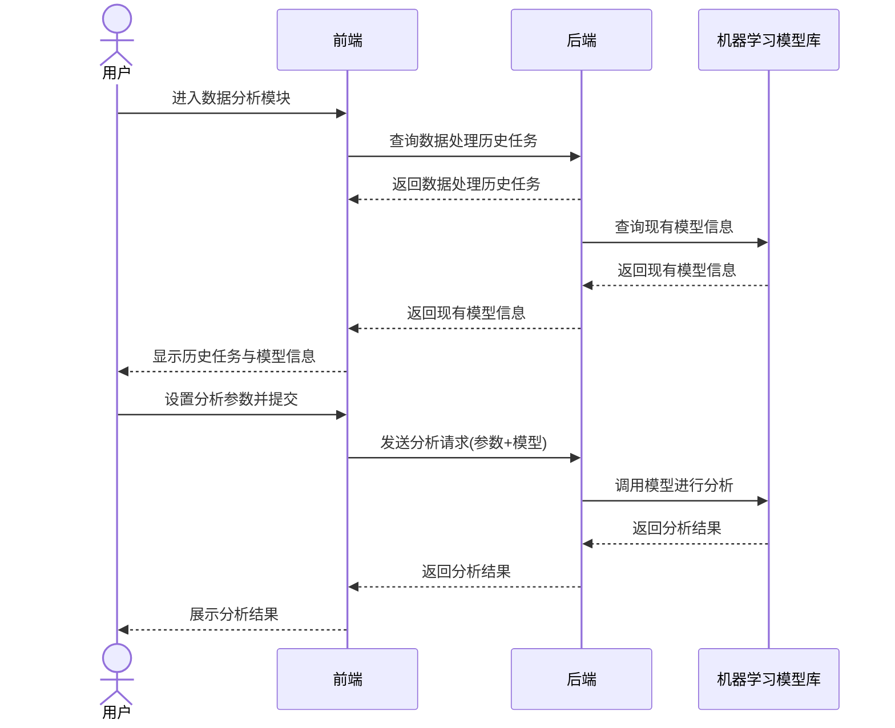
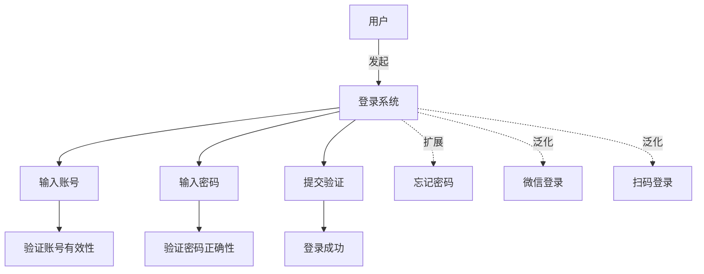

# my-notebook
个人笔记本
```python
import os

def generate_tree(path, indent='', deep=0):
    print(indent + os.path.basename(path))
	exclusion_list = ['.ipynb_checkpoints', '__pycache__', '.git', '.DS_Store', '.obsidian']
	suffix = ['os', 'jpg', 'png']
    if os.path.isdir(path):
        for item in os.listdir(path):
            if item == exclusion_list:
                continue
            elif item.split('.')[-1] in suffix:
                continue
            deep += 1
            indent = '|---'
            generate_tree(os.path.join(path, item), '|    ' * (deep-1) +indent, deep=deep, suffix=suffix)
            deep -= 1
 
generate_tree('/Users/fsm/Library/Mobile\\Documents/iCloud~md~obsidian/Documents/my-notebook')

```

## 文件结构
|---Quant
|    |---Backtrader
|    |    |---Backtrader的基础与使用.md
|    |    |---src
|    |---Quant Platform Development
|    |    |---个人量化平台开发.md
|    |---量化策略研究笔记
|    |    |---网格策略研究笔记.md
|---Latex与Markdown使用笔记
|    |---LaTeX使用笔记.md
|    |---ZotLit插件：Obsidian 与 Zotero 联动.md
|---ZoteroNote
|---DeepLearning
|    |---AI开发工具
|    |    |---LLaMaFactory
|    |    |    |---Quick Start.md
|    |    |---pytorch笔记
|    |    |    |---train代码学习笔记.md
|    |    |    |---Torchvision.md
|    |    |    |---optimizer.zero_grad().md
|    |    |    |---Pytorch 分布式训练.md
|    |---Lossfunction Note
|    |    |---Diceloss.md
|    |    |---img
|    |    |---FocalLoss.md
|    |    |---CrossEntropy.md
|    |---Transformer and Attention
|    |    |---详解Transformer （Attention Is All You Need）.md
|    |    |---对Transformer的理解.md
|    |    |---CV中的注意力机制.md
|    |    |---公式.md
|    |    |---Transformer 位置编码.md
|    |    |---src
|    |---other
|    |    |---深度学习环境
|    |    |    |---实验室服务器配置与IP.md
|    |    |    |---linux 服务器.md
|    |    |    |---Windows命令行.md
|    |    |    |---实验室服务器配置与IP.pdf
|    |    |    |---conda命令.md
|    |    |---公开数据集笔记
|    |    |    |---ImageNet数据集处理.md
|    |    |    |---Imagenet.md
|    |---NewStructure
|    |    |---Mamba.md
|    |---Model compression and deployment
|    |    |---模型参数量与显存计算.md
|    |    |---模型压缩技术概述.md
|    |    |---img
|    |---Convolution
|    |    |---转置卷积.md
|    |---Object detection
|    |    |---SmallObjectDetection
|    |    |    |---Review2023.md
|    |    |---.DS_Store
|    |    |---目标检测笔记.md
|    |    |---小目标检测.md
|    |    |---YOLO笔记.md
|    |    |---Object detection Matrics.md
|    |    |---YOLO series
|    |    |    |---source
|    |    |    |---yolo系列基本原理.md
|    |---RNN
|    |    |---RNN.md
|    |    |---LSTM.md
|    |    |---img
|    |---panoramic image mosaics
|    |    |---panoramic image mosaics.md
|    |    |---img
|    |---知识点笔记
|    |    |---Faster RCNN笔记.md
|    |    |---RANSAC（随机一致性采样）算法.md
|    |    |---img
|    |    |---未命名 1.md
|    |    |---Alexnet笔记—李沐课程.md
|    |    |---PCA——机器学习.md
|    |    |---模型训练技巧
|    |    |    |---未命名.md
|    |    |    |---Batch size与Learning rate的关系.md
|    |    |---Multi-Head Attention.md
|---Math Note
|    |---雅可比向量积.md
|    |---梯度和导数、图像中的梯度.md
|    |---L1-norm (L1范数) L2-norm(L2范数).md
|    |---LinearAlgebra
|    |---梯度、散度、旋度与拉普拉斯算子.md
|---随手记
|    |---SmallObjectDetection.md
|    |---zxw.md
|---Excalidraw
|---test.py
|---论文阅读笔记
|    |---CodeGeneration
|    |    |---LoRA阅读笔记.md
|    |    |---Intrinsic nature of code.md
|    |    |---Code Generation Dataset.md
|    |---source
|    |---多模态
|    |    |---CLIP.md
|    |---image
|    |    |---PM.PNG
|    |    |---PFnet.PNG
|    |    |---FM.PNG
|    |---光学遥感影像道路提取的方法综述阅读笔记.md
|    |---AnomalyGPT Note.md
|    |---CV
|    |    |---Vision Transformer.md
|    |    |---FaPN内容摘要.md
|    |    |---Segformer.md
|    |    |---Road
|    |    |    |---Improved Connectivity.md
|    |    |    |---CoANet笔记.md
|    |    |    |---D-LinkNet阅读笔记.md
|    |    |    |---VecRoad_ Point-based Iterative Graph Exploration for Road Graphs Extraction.md
|    |    |---Stacked Hourglass Networks for Human Pose Estimation.md
|    |    |---Deformable Convolutional Networks阅读翻译.md
|    |    |---ViT Vision in Transformer学习笔记.md
|    |    |---Swin Transformer.md
|    |    |---Segment anything.md
|    |    |---FCN学习笔记.md
|---README.md
|---Project
|    |---Quantum Chip Anomaly Detect
|    |    |---20250624 上海出差 Note.md
|---English
|    |---Grammer
|    |    |---Note
|    |    |    |---倒装句 & 被动态.pdf
|    |    |    |---动词笔记.pdf
|    |    |    |---副词.pdf
|    |    |    |---形容词.pdf
|    |    |    |---语法综述.pdf
|    |    |    |---数词.pdf
|    |    |    |---代词.pdf
|    |    |    |---连词.pdf
|    |    |    |---主谓一致.pdf
|    |    |    |---独立主格.pdf
|    |    |    |---非谓语 & 虚拟语气.pdf
|    |    |    |---时态.pdf
|    |    |    |---从句.pdf
|    |    |---动词.md
|    |    |---英语语法综述.md
|---.gitignore
|---Task List 2025.md
|---Computer Science
|    |---DevelopmentToolNotes
|    |    |---Docker
|    |    |    |---1.Docker架构与基本概念.md
|    |    |    |---Docker的跨平台问题.md
|    |    |    |---Docker架构与基本概念.md
|    |    |    |---Supplementary
|    |    |    |    |---0.Docker简易教程.md
|    |    |    |    |---2.Docker的跨平台问题.md
|    |    |    |    |---1.容器技术、Docker与K8S.md
|    |    |    |    |---3.理解镜像构成.md
|    |    |    |---0.Docker目录.md
|    |    |    |---img
|    |    |    |---4.Dockerfile定制镜像.md
|    |    |    |---Docker安装.md
|    |    |    |---2.Docker的安装.md
|    |    |    |---3.Docker容器使用.md
|    |    |---CMake
|    |    |    |---StartCmake.md
|    |    |---Mac命令行笔记.md
|    |    |---VScode
|    |    |    |---cpp配置文件.md
|    |    |    |---VScode配置SFTP.md
|    |    |    |---VSCode配置远程连接服务器.md
|    |    |---Git
|    |    |    |---Git使用笔记.md
|    |    |    |---Git and GitHub使用笔记.md
|    |    |    |---Git笔记.md
|    |    |    |---Git学习笔记.md
|    |    |---环境安装：MinGW-w64安装教程——著名C_C++编译器GCC的Windows版本.md
|    |---Progamming Language
|    |    |---basic
|    |    |    |---闭包(closure).md
|    |    |    |---作用域.md
|    |    |---CPP
|    |    |    |---Grammar
|    |    |    |    |---8. 关键字整理与总结.md
|    |    |    |    |---1.多态.md
|    |    |    |    |---3.函数与运算符重载.md
|    |    |    |    |---6.运算符.md
|    |    |    |    |---4.指针.md
|    |    |    |    |---2.类和对象.md
|    |    |    |    |---5.函数.md
|    |    |    |---.DS_Store
|    |    |    |---CMake简明教程
|    |    |    |    |---1.单个源文件.md
|    |    |    |    |---2. 多个源文件.md
|    |    |    |---PyBind简明操作.md
|    |    |    |---原理及基础：C和C++的编译过程--GCC编译器.md
|    |    |    |---C++多线程之Thread库.md
|    |    |    |---opencv
|    |    |    |    |---Mat.md
|    |    |    |    |---Opencv中的基本数据类型.md
|    |    |    |---知识点
|    |    |    |    |---1.C++类的构造函数和析构函数.md
|    |    |    |    |---10.future模板.md
|    |    |    |    |---3.流运算符.md
|    |    |    |    |---2. __ ，.，：，-_运算符到作用和区别.md
|    |    |    |    |---9.C++中的头文件.md
|    |    |    |    |---6.命名空间.md
|    |    |    |    |---5.动态内存.md
|    |    |    |    |---8.C++编译器.md
|    |    |    |    |---4.预处理器.md
|    |    |    |---C++的编译过程.md
|    |    |    |---C++中的静态库与动态库.md
|    |    |---python及相应工具笔记
|    |    |    |---.DS_Store
|    |    |    |---source
|    |    |    |---Python语法
|    |    |    |    |---async await异步编程.md
|    |    |    |    |---包、库等.md
|    |    |    |---第三方库
|    |    |    |    |---.DS_Store
|    |    |    |    |---Numpy
|    |    |    |    |    |---Broadcasting.md
|    |    |    |    |    |---Numpy 与List的效率分析.md
|    |    |    |    |    |---Numpy基础.md
|    |    |    |    |    |---numpy模块.md
|    |    |    |    |---yacs模块.md
|    |    |    |    |---Python中的Sys库.md
|    |    |    |    |---Matplotlib笔记.md
|    |    |    |---Python内置库
|    |    |    |    |---.DS_Store
|    |    |    |    |---argparse 命令行解析.md
|    |    |    |    |---Argparse模块.md
|    |    |    |    |---os模块.md
|    |    |    |    |---Python 中的partial().md
|    |---code note
|    |    |---the Average Path Length Similarity（APLS） 平均路径长度相似度.md
|    |    |---混淆矩阵计算与实现.md
|    |    |---多线程与多进程.md
|    |---ImageProcessing
|    |    |---FourierTransform.md
|    |    |---图像中的导数——一阶导数与二阶导数.md
|    |---Linux 奇技淫巧
|    |    |---.DS_Store
|    |    |---Screen 命令.md
|    |    |---啊！Linux.md
|    |    |---SSH协议与ssh命令.md
|    |    |---ShellScript
|    |    |    |---1. Shell概述.md
|    |    |    |---2.Shell脚本示例.md
|    |    |---src
|    |---经典机器学习算法
|    |    |---.DS_Store
|    |    |---PCA（Principal Component Analysis）.md
|    |    |---image
|    |    |---Kmeans算法解析.md
|    |    |---PCA——机器学习.md
|    |---Graphics
|    |    |---三维重建
|    |    |    |---双目相机.md
|    |    |    |---散斑结构光三维重建原理.md
|    |    |    |---双目散斑深度模组的深度自动检测和动态标定.md







