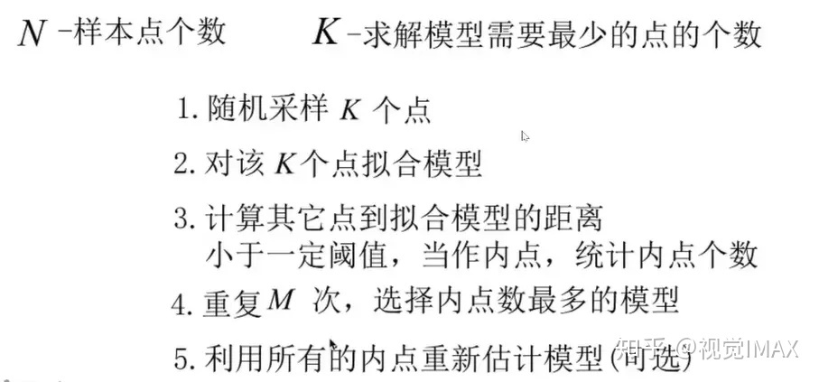

# RANSAC（随机一致性采样）算法

RANSAC主要解决样本中的外点问题，最多可处理50%的外点情况。

**基本思想**：

RANSAC通过反复选择数据中的一组随机子集来达成目标。被选取的子集被假设为局内点，并用下述方法进行验证：

1. 有一个模型适用于假设的局内点，即，所有的未知参数都能从假设的局内点计算得出。
2. 从上述模型测试所有其他数据，如果某个点适用于该模型，认为它是局内点。
3. 如果有足够多的点被归类为局内点，那么估计的模型就足够合理
4. 然后用所有假设的局内点重新估计模型。
5. 最后估计局内点与模型的错误率来评估模型。

重复执行上述过程固定次数，每次产生的模型要么因为局内点太少而被舍弃，要么因为比现有模型更好而被选用。

